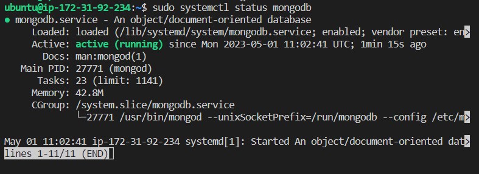
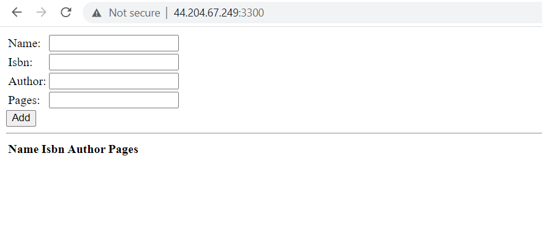

## Step 1: Install NodeJs ##

Node.js is a JavaScript runtime built on Chrome’s V8 JavaScript engine. Node.js is used in this project to set up the Express routes and AngularJS controllers.

`sudo apt update` 

`sudo apt upgrade`

`sudo apt -y install curl dirmngr apt-transport-https lsb-release ca-certificates`

`curl -sL https://deb.nodesource.com/setup_12.x | sudo -E bash -`

`sudo apt install -y nodejs` --- To install nodejs and flag yes (-y) for all prompt

## Step 2: MongoDB ##

MongoDB stores data in flexible, JSON-like documents. Fields in a database can vary from document to document and data structure can be changed over time. For this project, we are adding book records to MongoDB that contain book name, isbn number, author, and number of pages.

`sudo apt-key adv --keyserver hkp://keyserver.ubuntu.com:80 --recv 0C49F3730359A14518585931BC711F9BA15703C6` --- To add the mongoDB key serser

`echo "deb [ arch=amd64 ] https://repo.mongodb.org/apt/ubuntu trusty/mongodb-org/3.4 multiverse" | sudo tee /etc/apt/sources.list.d/mongodb-org-3.4.list` ---Add a repo to MongoDB

`sudo apt install -y mongodb` ---To install MongoDB

`sudo service mongodb start` ---Start the MongoDB Server

`sudo systemctl status mongodb` ---To verify if the service is running



`sudo apt install -y npm` ---Install npm – Node package manager: This command didn't work.
The below command was ran instead to install the nodejs and npm

`curl -fsSL https://deb.nodesource.com/setup_18.x | sudo -E bash -` ---get the location of Node.js software from Ubuntu repositories.

`sudo apt-get install -y nodejs` ---Installed both nodejs and npm 

`sudo npm install body-parser` ---Install body-parser package; this is needed to help us process JSON files passed in requests to the server.

`mkdir Books && cd Books` ---make directory Books and change to this new Directory

`npm init` ---Initialise npm project in this new directory

`vi server.js` ---Created a file server.js and added the below script

```
var express = require('express');
var bodyParser = require('body-parser');
var app = express();
app.use(express.static(__dirname + '/public'));
app.use(bodyParser.json());
require('./apps/routes')(app);
app.set('port', 3300);
app.listen(app.get('port'), function() {
console.log('Server up: http://localhost:' + app.get('port'));
});
```

## Step 3: INSTALL EXPRESS AND SET UP ROUTES TO THE SERVER ##

`sudo npm install express mongoose` 

`mkdir apps && cd apps`

`vi routes.js` ---copied the script below into the file

```
var Book = require('./models/book');
module.exports = function(app) {
app.get('/book', function(req, res) {
Book.find({}, function(err, result) {
if ( err ) throw err;
res.json(result);
});
});
app.post('/book', function(req, res) {
var book = new Book( {
name:req.body.name,
isbn:req.body.isbn,
author:req.body.author,
pages:req.body.pages
});
book.save(function(err, result) {
if ( err ) throw err;
res.json( {
message:"Successfully added book",
book:result
});
});
});
app.delete("/book/:isbn", function(req, res) {
Book.findOneAndRemove(req.query, function(err, result) {
if ( err ) throw err;
res.json( {
message: "Successfully deleted the book",
book: result
});
});
});
var path = require('path');
app.get('*', function(req, res) {
res.sendfile(path.join(__dirname + '/public', 'index.html'));
});
};
```
`mkdir models && cd models`

`vi book.js` ---copied the script below into the file

```
var mongoose = require('mongoose');
var dbHost = 'mongodb://localhost:27017/test';
mongoose.connect(dbHost);
mongoose.connection;
mongoose.set('debug', true);
var bookSchema = mongoose.Schema( {
name: String,
isbn: {type: String, index: true},
author: String,
pages: Number
});
var Book = mongoose.model('Book', bookSchema);
module.exports = mongoose.model('Book', bookSchema);
```

## Step 4 – Access the routes with AngularJS ##

`cd ../..` ---Changed the directory back to Books

`mkdir public && cd public` ---Created the folder public and changed to this directory

`vi script.js` ---copied the script below into the file

```
var app = angular.module('myApp', []);
app.controller('myCtrl', function($scope, $http) {
$http( {
method: 'GET',
url: '/book'
}).then(function successCallback(response) {
$scope.books = response.data;
}, function errorCallback(response) {
console.log('Error: ' + response);
});
$scope.del_book = function(book) {
$http( {
method: 'DELETE',
url: '/book/:isbn',
params: {'isbn': book.isbn}
}).then(function successCallback(response) {
console.log(response);
}, function errorCallback(response) {
console.log('Error: ' + response);
});
};
$scope.add_book = function() {
var body = '{ "name": "' + $scope.Name +
'", "isbn": "' + $scope.Isbn +
'", "author": "' + $scope.Author +
'", "pages": "' + $scope.Pages + '" }';
$http({
method: 'POST',
url: '/book',
data: body
}).then(function successCallback(response) {
console.log(response);
}, function errorCallback(response) {
console.log('Error: ' + response);
});
};
});
```

`vi index.html` ---copied the script below into the file and change the directory back to book

```
<!doctype html>
<html ng-app="myApp" ng-controller="myCtrl">
<head>
<script src="https://ajax.googleapis.com/ajax/libs/angularjs/1.6.4/angular.min.js"></script>
<script src="script.js"></script>
</head>
<body>
<div>
<table>
<tr>
<td>Name:</td>
<td><input type="text" ng-model="Name"></td>
</tr>
<tr>
<td>Isbn:</td>
<td><input type="text" ng-model="Isbn"></td>
</tr>
<tr>
<td>Author:</td>
<td><input type="text" ng-model="Author"></td>
</tr>
<tr>
<td>Pages:</td>
<td><input type="number" ng-model="Pages"></td>
</tr>
</table>
<button ng-click="add_book()">Add</button>
</div>
<hr>
<div>
<table>
<tr>
<th>Name</th>
<th>Isbn</th>
<th>Author</th>
<th>Pages</th>
</tr>
<tr ng-repeat="book in books">
<td>{{book.name}}</td>
<td>{{book.isbn}}</td>
<td>{{book.author}}</td>
<td>{{book.pages}}</td>
<td><input type="button" value="Delete" data-ng-click="del_book(book)"></td>
</tr>
</table>
</div>
</body>
</html>
```

`node server.js` ---Started the server with the result below


Port 3300 was opened from EC2 and IP+port no. was used to check the status of the project



